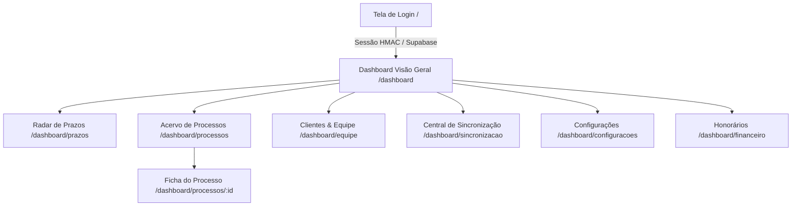

# Outro Cérebro — Documentação Completa da Plataforma Jurídica

> **Data de Consolidação:** 19 de Agosto de 2026  
> **Proprietário:** Pablo Maciel  
> **Hospedagem & Deploy:** Vercel (`https://outrocerebro.vercel.app`)  
> **Banco de Dados:** Supabase PostgreSQL  
> **Framework:** Next.js 16 (Turbopack, App Router, React 19, TypeScript, Vanilla/Tailwind CSS, Recharts, XLSX)  

---

## 1. Visão Geral e Arquitetura

O **Outro Cérebro** foi transformado em um ecossistema SaaS de Gestão Jurídica e Controladoria Estratégica. A arquitetura foi desenhada segundo os princípios de **Legal Design**, **Clareza Estrutural** e **Performance Extrema**, permitindo:

1. **Gestão de Acervo em Escala:** Consulta e filtros instantâneos sobre **3.883+ processos reais** com paginação rápida no cliente e servidor.
2. **Radar de Prazos & Semáforo Foco:** Visão categorizada de fatalidades (3 dias, esta semana, 15 dias e cumpridos no mês).
3. **Distribuição de Carga:** Visualização transparente da carga de trabalho e volume de ações por advogado da equipe.
4. **Central de Integrações e Sincronização (Integration Hub):** Três motores de leitura no navegador com reconciliação automática via *Upsert* no PostgreSQL.
5. **Analytics de Risco Contencioso:** Gráfico de Rosca (Donut Chart) dinâmico categorizando prognósticos de perda (*Remota, Possível, Provável*).

---

## 2. Mapa de Rotas e Fluxos Funcionais



### Detalhamento das Rotas:

| Rota | Componente / Função | Finalidade Principal |
| :--- | :--- | :--- |
| `/` | `app/page.tsx` + `LoginForm.tsx` | Autenticação segura com proteção contra força bruta e redirecionamento direto para o dashboard. |
| `/dashboard` | `app/dashboard/page.tsx` | Painel central: Radar de prazos fatais, KPIs de acervo, movimentações recentes, carga por advogado e gráfico de rosca. |
| `/dashboard/processos` | `app/dashboard/processos/page.tsx` | Data Grid paginado de 50 em 50 com busca instantânea por CNJ, autor, réu, matéria e advogado responsável. |
| `/dashboard/processos/[id]` | `app/dashboard/processos/[id]/page.tsx` | Ficha 360° do processo com todas as partes, foro, valores, prognóstico de risco e modal de edição interativa. |
| `/dashboard/equipe` | `app/dashboard/equipe/page.tsx` | Ranqueamento de advogados por volume de processos, matérias dominantes e valor total sob responsabilidade. |
| `/dashboard/sincronizacao` | `app/dashboard/sincronizacao/page.tsx` | **Sala de Máquinas**: Hub para upload e reconciliação de planilhas do CPJ, Âmbar (22 abas) e Pauta de Tarefas. |
| `/dashboard/configuracoes` | `app/dashboard/configuracoes/page.tsx` | Central de preferências administrativas, status de conexões e segurança. |
| `/dashboard/prazos` | `app/dashboard/prazos/page.tsx` | Agenda completa de prazos com marcação de urgência. |
| `/dashboard/financeiro` | `app/dashboard/financeiro/page.tsx` | Controle de honorários previstos e contingenciamento. |

---

## 3. Central de Sincronização: Os 3 Motores de Dados

A Central de Sincronização (`/dashboard/sincronizacao`) resolve o gargalo de digitação manual no escritório:

```
                          ┌──► Motor 1: CPJ / Auditoria (Base Geral de Processos)
                          │
[Planilhas Excel (.xlsx)] ┼──► Motor 2: Âmbar Energia (22 Abas / Riscos e Sentenças)
                          │
                          └──► Motor 3: Tarefas & Prazos (Pauta Pendente / Concluída)
                                         │
                                         ▼
                            [Upsert no Supabase PostgreSQL]
                       (Chave Mestra: `numero_processo`)
```

### Motor 1 — Importador Geral CPJ (`components/ImportadorPlanilha.tsx`)
- **Origem:** Planilha `Auditoria de cadastro de Processos.xlsx`.
- **Campos Mapeados:** `numero_processo`, `pj_protocolo`, `data_entrada`, `data_ajuizamento`, `materia`, `tema`, `acao`, `formato`, `grupo_trabalho`, `responsavel`, `advogado`, `autor`, `reu`, `juizo`, `status_resultado`, `valor_causa`.
- **Estratégia:** Envio em lotes de 250 registros para evitar sobrecarga de payload. Se o processo existir, atualiza; se não, cadastra.

### Motor 2 — Reconciliador Âmbar Energia (`components/SincronizadorAmbar.tsx`)
- **Origem:** Planilha corporativa `Relatório Jurídico Geral.xlsx`.
- **Varredura Multia-abas:** Lê automaticamente todas as 22 abas (*Juizado Especial, Justiça Federal Autora/Ré, Cível, Interior, Trabalhista, Tributário, etc.*).
- **Campos Estratégicos:** `risco_perda` (*REMOTA, POSSÍVEL, PROVÁVEL*), `andamento_cliente`, `fase_atual`, `valor_atualizado`, `sentenca_cliente`, `valor_sentenca`, `data_sentenca`, `advogado_interno_cliente`.
- **Estratégia:** Upsert em lotes de 200 registros ancorados no `numero_processo`.

### Motor 3 — Sincronizador de Tarefas (`components/SincronizadorTarefas.tsx`)
- **Origem:** Planilhas de atividades extraídas do CPJ.
- **Detecção Automática:** Identifica se a pauta é de tarefas pendentes ou cumpridas (verificando a coluna `Cumprido em`).
- **Campos Mapeados:** `numero_processo`, `pj_protocolo`, `evento`, `evento_principal`, `data_fatal`, `data_agenda`, `atribuido_para`, `sigla_tramitacao`, `status`, `data_conclusao`.
- **Garantia de Idempotência:** Constraint única `(numero_processo, evento, data_fatal)` impede duplicatas exatas.

---

## 4. Script de Criação do Banco de Dados (Supabase SQL)

Execute estes comandos no **SQL Editor** do Supabase para manter o banco sincronizado com todos os recursos:

```sql
-- 1. Habilitar extensão de UUID
CREATE EXTENSION IF NOT EXISTS "uuid-ossp";

-- 2. Tabela de Processos
DROP TABLE IF EXISTS processos CASCADE;

CREATE TABLE processos (
    id UUID DEFAULT uuid_generate_v4() PRIMARY KEY,
    numero_processo TEXT UNIQUE NOT NULL,
    pj_protocolo TEXT,
    
    -- Dados de Classificação
    data_entrada DATE,
    data_ajuizamento DATE,
    materia TEXT,
    tema TEXT,
    acao TEXT,
    formato TEXT,
    grupo_trabalho TEXT,
    responsavel TEXT,
    advogado TEXT,
    
    -- Partes e Juízo
    autor TEXT,
    reu TEXT,
    juizo TEXT,
    
    -- Status e Valores Internos
    status_resultado TEXT,
    valor_causa NUMERIC(15,2),
    
    -- Dados do Relatório Âmbar
    andamento_cliente TEXT,
    risco_perda TEXT,
    fase_atual TEXT,
    valor_atualizado NUMERIC(15,2),
    sentenca_cliente TEXT,
    valor_sentenca NUMERIC(15,2),
    data_sentenca DATE,
    advogado_interno_cliente TEXT,
    
    created_at TIMESTAMP WITH TIME ZONE DEFAULT TIMEZONE('utc'::text, NOW())
);

-- Índices otimizados para dashboards de alta performance
CREATE INDEX IF NOT EXISTS idx_processos_numero ON processos(numero_processo);
CREATE INDEX IF NOT EXISTS idx_processos_risco ON processos(risco_perda);
CREATE INDEX IF NOT EXISTS idx_processos_responsavel ON processos(responsavel);

-- 3. Tabela de Tarefas e Prazos
DROP TABLE IF EXISTS tarefas CASCADE;

CREATE TABLE tarefas (
    id UUID DEFAULT uuid_generate_v4() PRIMARY KEY,
    numero_processo TEXT,
    pj_protocolo TEXT,
    evento TEXT NOT NULL,
    evento_principal TEXT,
    data_fatal DATE,
    data_agenda DATE,
    atribuido_para TEXT,
    sigla_tramitacao TEXT,
    status TEXT DEFAULT 'Pendente',
    data_conclusao DATE,
    created_at TIMESTAMP WITH TIME ZONE DEFAULT TIMEZONE('utc'::text, NOW()),
    
    -- Previne duplicatas e permite atualização via Upsert
    CONSTRAINT uk_tarefa_unica UNIQUE (numero_processo, evento, data_fatal)
);

CREATE INDEX IF NOT EXISTS idx_tarefas_processo ON tarefas(numero_processo);
CREATE INDEX IF NOT EXISTS idx_tarefas_atribuido ON tarefas(atribuido_para);
```

---

## 5. Visualização Analítica de Riscos (`components/GraficoRisco.tsx`)

Desenvolvido com **Recharts**, o Gráfico Donut apresenta a proporção de contingenciamento da carteira:

| Categoria de Risco | Cor Funcional | Significado no Legal Design |
| :--- | :--- | :--- |
| **REMOTA** | `#10B981` (Verde Esmeralda) | Processos com alta probabilidade de êxito para o cliente. |
| **POSSÍVEL** | `#F59E0B` (Âmbar) | Causas com tese dividida; atenção moderada necessária. |
| **PROVÁVEL** | `#EF4444` (Vermelho) | Perigo de desembolso financeiro; foco prioritário em acordos e contingenciamento. |
| **NÃO AVALIADO** | `#9CA3AF` (Cinza) | Processos recém-distribuídos aguardando prognóstico. |

---

## 6. Correções e Otimizações Realizadas

1. **Correção do Bloqueio de Rolagem (Scroll Lock):**
   - Removida a propriedade `overflow: hidden;` na tag `body` de `app/globals.css`.
   - Ajustado o container `<main>` em `app/dashboard/layout.tsx` para rolagem vertical suave e natural.
2. **Processamento 100% no Cliente para Planilhas:**
   - O leitor `xlsx` roda na memória do browser do usuário, eliminando lentidão no servidor.
3. **Deploy Automatizado e Direto na Vercel:**
   - Removidas configurações legadas (`.openai/hosting.json`, `worker/`, `vite.config.ts`).
   - Compilação estrita com `next build` gerando todas as rotas com SSR e Server Components em menos de 5 segundos.
4. **Cobertura de Testes:**
   - 37 testes comportamentais e de isolamento por usuário executados com sucesso via `npm test`.

---

## 7. Como Operar e Atualizar

```bash
# Iniciar ambiente de desenvolvimento local
npm run dev

# Rodar a suíte de testes
npm test

# Compilar build de produção
npm run build
```

---
*Documentação gerada e sincronizada para o repositório [pablomaciel14/outrocerebro](https://github.com/pablomaciel14/outrocerebro).*
