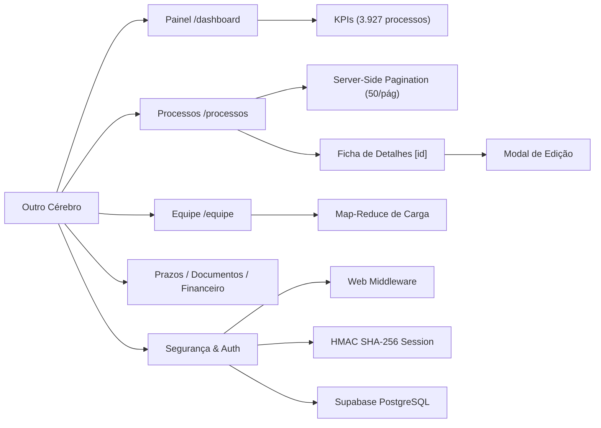

# Outro Cérebro — Gestão Jurídica & Dashboard Estratégico

Sistema proprietário, privado e de alto desempenho para gestão contenciosa, acervo de processos e inteligência operacional de **Pablo Maciel**.

> **IA ou desenvolvedor chegando ao projeto:** comece por [AGENTS.md](AGENTS.md). Ele contém o contexto obrigatório, as regras de segurança e a ordem recomendada de leitura.

---

## 🏛️ O que o sistema reúne

- **Painel Geral & KPIs Estratégicos (`/dashboard`)**: Visão consolidada do acervo com 3.927 processos, métricas de distribuição por matéria, ações ativas, principais clientes e movimentações recentes.
- **Acervo de Processos (`/dashboard/processos`)**: Data grid de alta velocidade com paginação no servidor (*Server-Side Pagination* de 50 em 50 registros), filtros por matéria/status e busca instantânea por partes e número de processo.
- **Ficha Completa do Processo (`/dashboard/processos/[id]`)**: Visualização detalhada de partes (polo ativo/passivo), matéria, tema, juízo, advogado responsável, prazos e modal interativo de edição em tempo real (`EditProcessModal`).
- **Equipe & Distribuição de Carga (`/dashboard/equipe`)**: Balanceamento de carga processual por advogado consolidado via *Map-Reduce* no servidor, ranqueamento automático e barras visuais de progresso em dupla camada.
- **Módulos Estratégicos**:
  - 📅 **Agenda & Prazos (`/dashboard/prazos`)**: Controle de fatalidades, intimações e publicações judiciais com sinalização de urgência.
  - 📁 **Documentos (`/dashboard/documentos`)**: Repositório de modelos de peças, procurações e documentos probatórios.
  - 💰 **Honorários (`/dashboard/financeiro`)**: Gestão de honorários contratuais, sucumbências e faturamento.
  - ⚙️ **Configurações (`/dashboard/configuracoes`)**: Parâmetros do escritório, segurança e integrações de banco de dados.
- **Design "Claridade Estrutural" (TDAH-Friendly & Foco)**:
  - Fundo em off-white quente (`#FAFAFA`) que elimina a fadiga visual e o choque de contraste.
  - Cartões em branco puro (`#FFFFFF`) com bordas suaves (`#E5E7EB`) e sombras sutis.
  - Tipografia geométrica sem serifa **Inter** com renderização nítida (`antialiased`).
  - Vocabulário visual minimalista com ícones de linha (`strokeWidth={1.5}`).
  - Cores funcionais padronizadas para status (sucesso, em andamento, aviso e erro).
  - Ícone de sino no cabeçalho superior direito para alerta de novas intimações.

Site principal: <https://outrocerebro.com.br>

---

## 📚 Mapa da Documentação

| Documento | Conteúdo |
| :--- | :--- |
| [AGENTS.md](AGENTS.md) | Entrada obrigatória para IAs e regras mestras do projeto |
| [Visão geral](docs/00-VISAO-GERAL.md) | Conceito, filosofia de Legal Design e princípios de foco |
| [Áreas e fluxos](docs/01-AREAS-E-FLUXOS.md) | Detalhamento de todos os módulos de gestão contenciosa |
| [Arquitetura](docs/02-ARQUITETURA.md) | App Router, Server Components, Web Middleware e Supabase |
| [Dados e segurança](docs/03-DADOS-E-SEGURANCA.md) | Modelagem da tabela `processos`, isolamento e HMAC SHA-256 |
| [Operação e manutenção](docs/04-OPERACAO-E-MANUTENCAO.md) | Comandos, testes comportamentais e publicação |
| [Grafo da documentação](docs/GRAFO-DA-DOCUMENTACAO.md) | Grafo Mermaid relacionando módulos, dados e fluxos |
| [Changelog](docs/CHANGELOG.md) | Histórico de entregas e versões |

---

## 🗺️ Grafo Resumido



---

## ⚡ Comandos Rápidos

```bash
# Instalar dependências
npm install

# Iniciar ambiente local de desenvolvimento
npm run dev

# Validar compilação de produção
npm run build

# Executar suíte de testes comportamentais
npm test

# Executar linter
npm run lint
```
