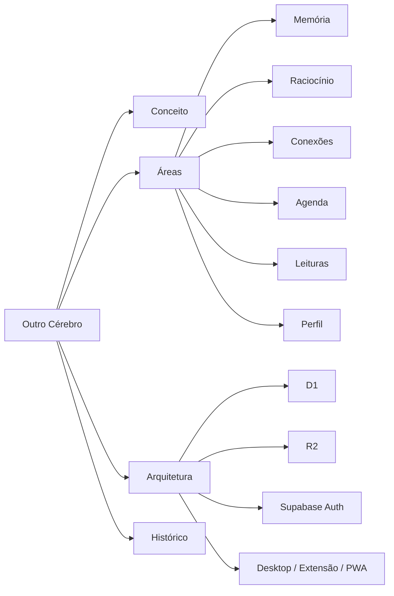

# Outro Cérebro

Sistema pessoal, privado e não comercial de organização de conhecimento de Pablo Maciel.

> **IA ou programador chegando ao projeto:** comece por [AGENTS.md](AGENTS.md). Ele contém o contexto obrigatório, as regras de segurança e a ordem recomendada de leitura.

## O que o sistema reúne

- páginas editáveis nas áreas Memória, Raciocínio e Conexões;
- cinco templates editáveis inspirados em usos populares do Notion;
- agenda mensal com tarefas e compromissos;
- biblioteca privada de PDFs;
- leitura com Markdown, progresso, cronômetro, marcadores, destaques e notas;
- menu de perfil com tema, área padrão ao entrar e logout;
- temas claro e escuro em computador, tablet e celular;
- instalável como PWA, aplicativo Desktop (Windows) e extensão Chrome.

Site: <https://outrocerebro.com.br>

## Documentação

| Documento | Conteúdo |
| --- | --- |
| [AGENTS.md](AGENTS.md) | entrada obrigatória para IAs e regras do projeto |
| [Visão geral](docs/00-VISAO-GERAL.md) | conceito, princípios, escopo e maturidade |
| [Áreas e fluxos](docs/01-AREAS-E-FLUXOS.md) | todas as áreas e funcionalidades |
| [Arquitetura](docs/02-ARQUITETURA.md) | estrutura, rotas, APIs e fluxos técnicos |
| [Dados e segurança](docs/03-DADOS-E-SEGURANCA.md) | persistência, autenticação e proteções |
| [Operação e manutenção](docs/04-OPERACAO-E-MANUTENCAO.md) | desenvolvimento, cuidados e publicação |
| [Grafo da documentação](docs/GRAFO-DA-DOCUMENTACAO.md) | mapa visual com links entre todos os assuntos |
| [Changelog](docs/CHANGELOG.md) | última atualização e histórico consolidado |

## Grafo resumido



O [grafo completo e navegável](docs/GRAFO-DA-DOCUMENTACAO.md) relaciona todas as áreas, serviços e documentos.

## Publicação

A produção em `outrocerebro.com.br` é hospedada pelo Sites, conforme `.openai/hosting.json`. O GitHub é o repositório principal, mas um `git push` não publica o site sozinho: toda versão precisa ser sincronizada, salva e implantada no projeto Sites existente. Consulte o [fluxo obrigatório de produção](docs/04-OPERACAO-E-MANUTENCAO.md#fluxo-obrigatório-de-produção).

## Última atualização

Em **16 de agosto de 2026**, o fluxo obrigatório entre GitHub e Sites foi documentado para impedir que um push seja confundido com uma publicação concluída. Consulte o [histórico completo](docs/CHANGELOG.md).

## Comandos rápidos

```bash
npm install
npm run dev
npm run build
npm test
npm run lint
```

`npm install` também ativa o hook de documentação do projeto — ver [Operação — Automação de documentação](docs/04-OPERACAO-E-MANUTENCAO.md#automação-de-documentação).
