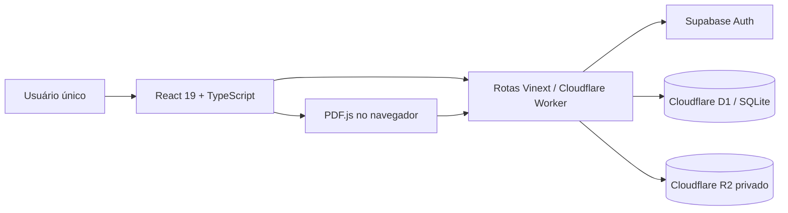

# Arquitetura e estrutura do código

[← Áreas e fluxos](01-AREAS-E-FLUXOS.md) · [Próximo: dados e segurança →](03-DADOS-E-SEGURANCA.md) · [Ver grafo](GRAFO-DA-DOCUMENTACAO.md)

## Visão arquitetural



## Camada de interface

- React 19 e TypeScript.
- Vinext sobre Vite, com saída compatível com Cloudflare Workers.
- CSS próprio em `app/globals.css`.
- `lucide-react` para ícones vetoriais.
- `pdfjs-dist` carregado pelo fluxo de Leituras.
- temas claro e escuro controlados no cliente.

## Rotas de página

| Arquivo | Responsabilidade |
| --- | --- |
| `app/page.tsx` | entrada e apresentação do login |
| `app/workspace/page.tsx` | proteção da sessão e escolha da área |
| `app/workspace/WorkspaceClient.tsx` | páginas, templates e agenda |
| `app/workspace/leituras/page.tsx` | proteção da rota de Leituras |
| `app/workspace/leituras/ReadingClient.tsx` | biblioteca e leitor de PDFs |

## APIs

| Rota | Responsabilidade |
| --- | --- |
| `/api/auth/login` | autenticação e criação da sessão |
| `/api/auth/logout` | encerramento da sessão |
| `/api/workspace` | CRUD de páginas e itens da agenda |
| `/api/readings` | upload, listagem, progresso, PDF e exclusão |
| `/api/highlights` | destaques e notas |
| `/api/bookmarks` | marcadores de página |

## Estrutura de pastas

```text
OutroCerebro/
├── AGENTS.md                 entrada obrigatória para IAs
├── README.md                 índice humano e mapa da documentação
├── docs/                     documentação temática e changelog
├── app/
│   ├── api/                  endpoints autenticados
│   ├── workspace/            workspace e leituras
│   ├── personal-auth.ts      sessão pessoal
│   ├── security.ts           validações compartilhadas
│   └── globals.css           sistema visual e responsividade
├── db/
│   ├── index.ts              acesso centralizado ao D1
│   └── schema.ts             modelo Drizzle/SQLite
├── drizzle/                  migrações versionadas
├── public/                   marca, favicons e recursos estáticos
├── tests/                    verificações automatizadas
└── .openai/hosting.json      bindings lógicos do Sites
```

## Fluxos principais

### Criar e editar página

```text
Galeria de templates → POST /api/workspace → D1
                    → editor abre → debounce de 700 ms
                    → PATCH /api/workspace → D1
```

### Ler PDF

```text
Upload no navegador → POST /api/readings
                   → metadados no D1
                   → bytes privados no R2
                   → PDF.js renderiza e extrai texto
                   → progresso/destaques/marcadores voltam ao D1
```

## Decisões técnicas

- D1 é usado para dados pesquisáveis e relacionais.
- R2 é usado para bytes de PDF.
- Supabase não armazena páginas, agenda ou PDFs; autentica o proprietário.
- Templates são definidos no cliente como estruturas iniciais; a página criada é um registro normal e totalmente editável.
- O leitor é carregado separadamente para não aumentar desnecessariamente o custo inicial do workspace.
