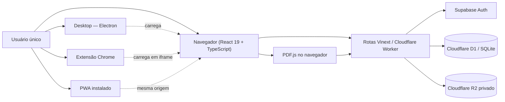

# Arquitetura e estrutura do código

[← Áreas e fluxos](01-AREAS-E-FLUXOS.md) · [Próximo: dados e segurança →](03-DADOS-E-SEGURANCA.md) · [Ver grafo](GRAFO-DA-DOCUMENTACAO.md)

## Visão arquitetural



Desktop, Extensão e PWA são *thin clients*: nenhum tem lógica própria, todos carregam `https://outrocerebro.com.br` (ver [Clientes da Plataforma](04-OPERACAO-E-MANUTENCAO.md#clientes-da-plataforma-desktop-extensão-e-mobile)). Publicar no site atualiza os três automaticamente, sem gerar novos instaladores.

A produção é gerenciada pelo Sites. O GitHub permanece como repositório principal, mas o Sites mantém a origem usada pela hospedagem e as versões implantáveis; portanto, o mesmo commit validado precisa ser sincronizado com o Sites e implantado por ele para alcançar `outrocerebro.com.br`.

## Camada de interface

- React 19 e TypeScript.
- Vinext sobre Vite, com saída compatível com Cloudflare Workers.
- CSS próprio em `app/globals.css`.
- `lucide-react` para ícones vetoriais.
- `pdfjs-dist` carregado pelo fluxo de Leituras.
- temas claro e escuro controlados no cliente.

## Rotas de página

| Arquivo | Responsabilidade |
| --- | --- |
| `app/page.tsx` | entrada e apresentação do login |
| `app/workspace/page.tsx` | proteção da sessão e escolha da área |
| `app/workspace/WorkspaceClient.tsx` | páginas, templates e agenda |
| `app/workspace/leituras/page.tsx` | proteção da rota de Leituras |
| `app/workspace/leituras/ReadingClient.tsx` | biblioteca e leitor de PDFs |

Componentes compartilhados relevantes: `app/ProfileMenu.tsx` (perfil, tema, área padrão, sair), `app/ThemeToggle.tsx`, `app/InstallAppButton.tsx` (ícones de instalação de Desktop/Extensão/PWA, na barra lateral), `app/PWARegister.tsx` (registra o service worker em `app/layout.tsx`, para todas as rotas).

## APIs

| Rota | Responsabilidade |
| --- | --- |
| `/api/auth/login` | autenticação e criação da sessão |
| `/api/auth/logout` | encerramento da sessão |
| `/api/workspace` | CRUD de páginas e itens da agenda |
| `/api/readings` | upload, listagem, progresso, PDF e exclusão |
| `/api/highlights` | destaques e notas |
| `/api/bookmarks` | marcadores de página |
| `/api/preferences` | área padrão ao entrar (perfil) |

## Estrutura de pastas

```text
OutroCerebro/
├── AGENTS.md                 entrada obrigatória para IAs
├── README.md                 índice humano e mapa da documentação
├── docs/                     documentação temática e changelog
├── .githooks/pre-commit      checagem de documentação (ver Operação)
├── app/
│   ├── api/                  endpoints autenticados
│   ├── workspace/            workspace e leituras
│   ├── personal-auth.ts      sessão pessoal
│   ├── chatgpt-auth.ts       headers do ChatGPT Apps SDK (não confiáveis, ver Dados e segurança)
│   ├── login-throttle.ts     lógica pura de bloqueio de login (testável)
│   ├── security.ts           validações compartilhadas (CSRF, UUID, PDF)
│   ├── ProfileMenu.tsx       menu de perfil (tema, área padrão, sair)
│   ├── PWARegister.tsx       registra o service worker do PWA
│   ├── InstallAppButton.tsx  ícones de instalação (Desktop/Extensão/PWA)
│   └── globals.css           sistema visual e responsividade
├── db/
│   ├── index.ts              acesso centralizado ao D1
│   └── schema.ts             modelo Drizzle/SQLite
├── drizzle/                  migrações versionadas
├── worker/index.ts           entrada do Cloudflare Worker
├── desktop/                  aplicativo Windows (Electron, thin client)
├── extension/                extensão Chrome (Manifest V3, thin client)
├── public/                   marca, favicons, sw.js (PWA) e recursos estáticos
├── tests/                    verificações automatizadas (ver Testes, abaixo)
├── examples/                 referência isolada, não usada pelo app em produção
└── .openai/hosting.json      bindings lógicos do Sites
```

## Testes

Tudo em `tests/`, executado por `npm test` (`npm run build && node --test`, com autodescoberta — qualquer novo arquivo `*.test.mjs` já entra na suíte automaticamente).

| Arquivo | Cobre |
| --- | --- |
| `tests/security.test.mjs` | `rejectCrossSiteMutation`, `validUuid`, `readLimitedJson`, `sha256` e `validatePdfSubmission` (`app/security.ts`), com `Request`/`File` reais |
| `tests/login-throttle.test.mjs` | lógica pura de bloqueio de login (`app/login-throttle.ts`): acumulação de falhas, bloqueio, expiração, reset de janela |
| `tests/user-isolation.test.mjs` | isolamento de `userId` entre dois usuários em todas as tabelas, contra um banco SQLite real (`tests/helpers/sqlite-db.mjs`, via `node:sqlite` nativo + `drizzle-orm/sqlite-proxy`, rodando as migrações reais de `drizzle/`) |
| `tests/rendered-html.test.mjs` | checagens de texto no código-fonte (presença de rotas, strings de UI, estrutura da documentação) |

Limitação conhecida: os testes de isolamento validam o padrão de consulta contra SQLite real, não o binding D1/Worker nem os handlers HTTP completos (que importam `cloudflare:workers`, não resolvível fora do runtime de Workers). Uma suíte de integração via Miniflare/`@cloudflare/vitest-pool-workers` cobriria isso, mas não existe ainda. `desktop/`, `extension/` e o fluxo de PWA/perfil também não têm teste automatizado — só o schema/lógica pura por trás deles.

## Fluxos principais

### Criar e editar página

```text
Galeria de templates → POST /api/workspace → D1
                    → editor abre → debounce de 700 ms
                    → PATCH /api/workspace → D1
```

### Ler PDF

```text
Upload no navegador → POST /api/readings
                   → metadados no D1
                   → bytes privados no R2
                   → PDF.js renderiza e extrai texto
                   → progresso/destaques/marcadores voltam ao D1
```

## Decisões técnicas

- D1 é usado para dados pesquisáveis e relacionais.
- R2 é usado para bytes de PDF.
- Supabase não armazena páginas, agenda ou PDFs; autentica o proprietário.
- Templates são definidos no cliente como estruturas iniciais; a página criada é um registro normal e totalmente editável.
- O leitor é carregado separadamente para não aumentar desnecessariamente o custo inicial do workspace.
