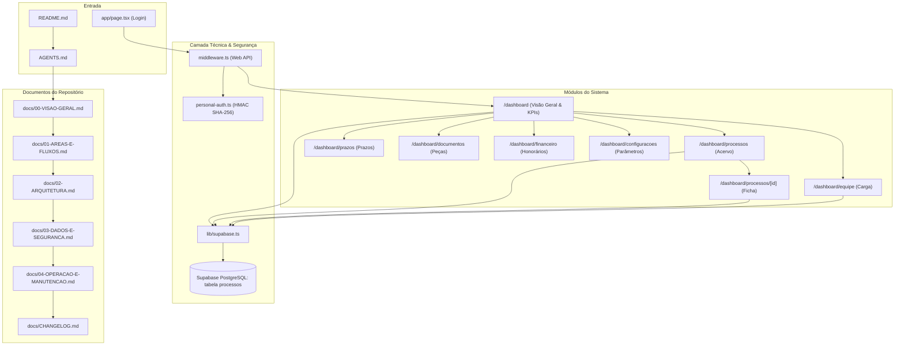

# Grafo Navegável da Documentação

[← Índice](../README.md) · [Visão geral](00-VISAO-GERAL.md) · [Changelog](CHANGELOG.md)

```mermaid
flowchart TD
    subgraph Entrada
        README["README.md"]
        AGENTS["AGENTS.md"]
        LOGIN["app/page.tsx (Login)"]
    end

    subgraph Modulos["Módulos do Sistema"]
        DASH["/dashboard (Visão Geral & KPIs)"]
        PROC["/dashboard/processos (Acervo)"]
        FICH["/dashboard/processos/[id] (Ficha)"]
        EQUIP["/dashboard/equipe (Carga)"]
        PRAZ["/dashboard/prazos (Prazos)"]
        DOCS["/dashboard/documentos (Peças)"]
        FIN["/dashboard/financeiro (Honorários)"]
        CONF["/dashboard/configuracoes (Parâmetros)"]
    end

    subgraph CamadaTecnica["Camada Técnica & Segurança"]
        MID["middleware.ts (Web API)"]
        AUTH["personal-auth.ts (HMAC SHA-256)"]
        SUPA["lib/supabase.ts"]
        POSTGRES[("Supabase PostgreSQL: tabela processos")]
    end

    subgraph Documentacao["Documentos do Repositório"]
        DOC0["docs/00-VISAO-GERAL.md"]
        DOC1["docs/01-AREAS-E-FLUXOS.md"]
        DOC2["docs/02-ARQUITETURA.md"]
        DOC3["docs/03-DADOS-E-SEGURANCA.md"]
        DOC4["docs/04-OPERACAO-E-MANUTENCAO.md"]
        HIST["docs/CHANGELOG.md"]
    end

    README --> AGENTS
    AGENTS --> DOC0
    DOC0 --> DOC1
    DOC1 --> DOC2
    DOC2 --> DOC3
    DOC3 --> DOC4
    DOC4 --> HIST

    LOGIN --> MID
    MID --> DASH
    DASH --> PROC
    PROC --> FICH
    DASH --> EQUIP
    DASH --> PRAZ
    DASH --> DOCS
    DASH --> FIN
    DASH --> CONF

    DASH --> SUPA
    PROC --> SUPA
    FICH --> SUPA
    EQUIP --> SUPA
    SUPA --> POSTGRES
    MID --> AUTH

    click README "./README.md" "Abrir README"
    click AGENTS "./AGENTS.md" "Abrir AGENTS"
    click DOC0 "./docs/00-VISAO-GERAL.md" "Abrir Visão Geral"
    click DOC1 "./docs/01-AREAS-E-FLUXOS.md" "Abrir Áreas e Fluxos"
    click DOC2 "./docs/02-ARQUITETURA.md" "Abrir Arquitetura"
    click DOC3 "./docs/03-DADOS-E-SEGURANCA.md" "Abrir Dados e Segurança"
    click DOC4 "./docs/04-OPERACAO-E-MANUTENCAO.md" "Abrir Operação"
    click HIST "./docs/CHANGELOG.md" "Abrir Changelog"
```
