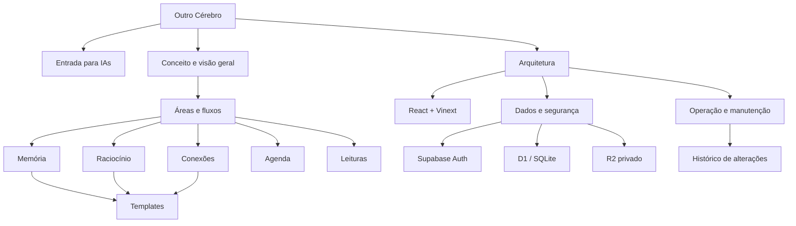

# Grafo navegável da documentação

[← Índice principal](../README.md) · [Instruções para IAs](../AGENTS.md)

Este grafo mostra como conceito, funções e implementação se relacionam. Os nós possuem links clicáveis em renderizadores Mermaid compatíveis; a lista abaixo garante navegação em qualquer leitor Markdown.

## Links diretos

- [Entrada para IAs e regras obrigatórias](../AGENTS.md)
- [Conceito, princípios e estado de maturidade](00-VISAO-GERAL.md)
- [Memória, Raciocínio, Conexões, Templates, Agenda e Leituras](01-AREAS-E-FLUXOS.md)
- [Componentes, rotas, APIs e fluxos técnicos](02-ARQUITETURA.md)
- [Banco, arquivos, autenticação e segurança](03-DADOS-E-SEGURANCA.md)
- [Desenvolvimento, manutenção e publicação](04-OPERACAO-E-MANUTENCAO.md)
- [Última atualização e histórico](CHANGELOG.md)
