# Grafo navegável da documentação

[← Índice principal](../README.md) · [Instruções para IAs](../AGENTS.md)

Este grafo mostra como conceito, funções e implementação se relacionam. Os nós possuem links clicáveis em renderizadores Mermaid compatíveis; a lista abaixo garante navegação em qualquer leitor Markdown.

```mermaid
flowchart TD
    ROOT["Outro Cérebro"]
    AI["Entrada para IAs"]
    CONCEPT["Conceito e visão geral"]
    AREAS["Áreas e fluxos"]
    ARCH["Arquitetura"]
    DATA["Dados e segurança"]
    OPS["Operação e manutenção"]
    LOG["Histórico de alterações"]

    MEM["Memória"]
    REASON["Raciocínio"]
    LINKS["Conexões"]
    CAL["Agenda"]
    READ["Leituras"]
    TPL["Templates"]
    PERFIL["Perfil"]

    AUTH["Supabase Auth"]
    D1["D1 / SQLite"]
    R2["R2 privado"]
    UI["React + Vinext"]
    TESTS["Testes automatizados"]

    CLIENTS["Clientes dedicados"]
    DESKTOP["Desktop (Electron)"]
    EXT["Extensão Chrome"]
    PWA["PWA instalável"]

    HOOK["Automação de documentação"]

    ROOT --> AI
    ROOT --> CONCEPT
    CONCEPT --> AREAS
    AREAS --> MEM
    AREAS --> REASON
    AREAS --> LINKS
    AREAS --> CAL
    AREAS --> READ
    AREAS --> PERFIL
    MEM --> TPL
    REASON --> TPL
    LINKS --> TPL
    ROOT --> ARCH
    ARCH --> UI
    ARCH --> DATA
    ARCH --> TESTS
    DATA --> AUTH
    DATA --> D1
    DATA --> R2
    ARCH --> OPS
    OPS --> LOG
    OPS --> CLIENTS
    CLIENTS --> DESKTOP
    CLIENTS --> EXT
    CLIENTS --> PWA
    OPS --> HOOK

    click AI "../AGENTS.md" "Abrir instruções para IAs"
    click CONCEPT "./00-VISAO-GERAL.md" "Abrir visão geral"
    click AREAS "./01-AREAS-E-FLUXOS.md" "Abrir áreas e fluxos"
    click MEM "./01-AREAS-E-FLUXOS.md#memória" "Abrir Memória"
    click REASON "./01-AREAS-E-FLUXOS.md#raciocínio" "Abrir Raciocínio"
    click LINKS "./01-AREAS-E-FLUXOS.md#conexões" "Abrir Conexões"
    click CAL "./01-AREAS-E-FLUXOS.md#agenda" "Abrir Agenda"
    click READ "./01-AREAS-E-FLUXOS.md#leituras" "Abrir Leituras"
    click TPL "./01-AREAS-E-FLUXOS.md#templates" "Abrir Templates"
    click PERFIL "./01-AREAS-E-FLUXOS.md#perfil" "Abrir Perfil"
    click ARCH "./02-ARQUITETURA.md" "Abrir arquitetura"
    click DATA "./03-DADOS-E-SEGURANCA.md" "Abrir dados e segurança"
    click TESTS "./02-ARQUITETURA.md#testes" "Abrir testes"
    click OPS "./04-OPERACAO-E-MANUTENCAO.md" "Abrir operação"
    click LOG "./CHANGELOG.md" "Abrir histórico"
    click CLIENTS "./04-OPERACAO-E-MANUTENCAO.md#clientes-da-plataforma-desktop-extensão-e-mobile" "Abrir clientes dedicados"
    click HOOK "./04-OPERACAO-E-MANUTENCAO.md#automação-de-documentação" "Abrir automação de documentação"
```

## Links diretos

- [Entrada para IAs e regras obrigatórias](../AGENTS.md)
- [Conceito, princípios e estado de maturidade](00-VISAO-GERAL.md)
- [Memória, Raciocínio, Conexões, Templates, Agenda, Leituras e Perfil](01-AREAS-E-FLUXOS.md)
- [Componentes, rotas, APIs, fluxos técnicos e testes](02-ARQUITETURA.md)
- [Banco, arquivos, autenticação e segurança](03-DADOS-E-SEGURANCA.md)
- [Desenvolvimento, manutenção, publicação obrigatória pelo Sites, clientes dedicados e automação de documentação](04-OPERACAO-E-MANUTENCAO.md)
- [Última atualização e histórico](CHANGELOG.md)

## O que falta / planejado

Lista viva do que ainda não existe, para IAs e programadores não assumirem que já está pronto — detalhes em cada documento linkado:

- Backlinks e grafo automático entre páginas a partir de `[[...]]` ([Visão geral](00-VISAO-GERAL.md#estado-de-maturidade)).
- OCR para PDF digitalizado ([Visão geral](00-VISAO-GERAL.md#estado-de-maturidade)).
- Testes automatizados de integração real (D1/Worker via Miniflare) e para Desktop/Extensão/PWA/perfil ([Arquitetura — Testes](02-ARQUITETURA.md#testes)).
- Pipeline de CI/CD para publicar o instalador do Desktop e o `.zip` da Extensão — hoje é manual ([Operação — Clientes da Plataforma](04-OPERACAO-E-MANUTENCAO.md#clientes-da-plataforma-desktop-extensão-e-mobile)).
- `desktop/build-installer.js` não está ligado a nenhum script `npm` e não bate com o pipeline atual do `electron-builder` — confirmar se é legado antes de usar ou documentar como oficial ([Operação — Clientes da Plataforma](04-OPERACAO-E-MANUTENCAO.md#clientes-da-plataforma-desktop-extensão-e-mobile)).
